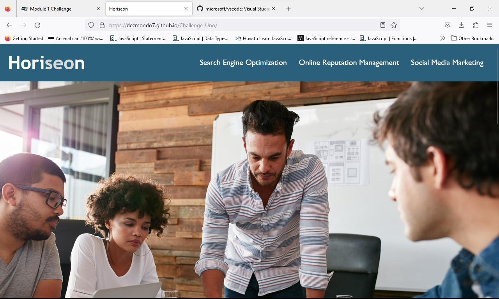

# Challenge_Uno
Challenge one of the course
The aim of this project is to improve the accesibilty of the Horiseon website.
This will be documented in the below with step by step changes made to improve the site's accesibilty.

By updating the site's accesibilty it allows users who may have impairments to read the content of the images. The accesibilty also help's with SEO (search engine optimization) when users are searching to find the website via search engines.

## Updated Changes
Changed the title from website to Horiseon
Added alt tag & description to ./assets/images/search-engine-optimization.jpeg
Added alt tag & description to ./assets/images/online-reputation-management.jpg
Re-arranged the CSS linking all the correctly styled items together in the way I imagined that they would be coded so that it is easier to read
Added comments to the HTML file
Added comments to the CSS file
Added sematic tags to the HTML 
Changed class of the navigation bar to .navbar
updated CSS file to match .navbar
Added Alt tag & description to /assets/images/social-media-marketing.jp
Added alt tag & description to ./assets/images/brand-awareness.png
Added alt tag & description to ./assets/images/cost-management.png
Removed </image> tag and closed off section correctly with />

### Website Uploads
Below are three screenshots of the final version of the Horiseon website which has been uploaded to github and can be found at https://dezmondo7.github.io/Challenge_Uno/

